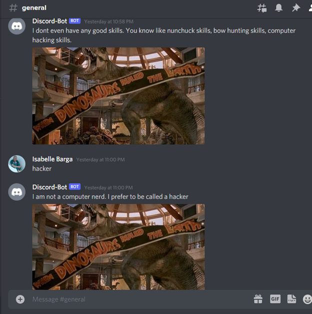

  - Setup
    - For this instance, you can get an API token by first creating an application, a bot, and a server. 
    The bot will give you a token to refer to it with. An API token is like a password and you can even 
    have your API regenerate this token if it compromised by going to the bot tab and selecting regenerate.
    - You put the Token in the .env file and your code reads it with dotenv and allows you to keep your secrets.
    The .env is important to keep seperate and remain untracked so you do not expose your token. But it has to
    be in the same directory so that your .py file can read it.
    - First of all, it is important to have your packages up-to-date. But your program depends on the installation of
    python3, discord.py, and python-dotenv packages.
  - Usage
    - When you type "hacker" in discord, the bot will send a movie quote related to computers/hacking. I won't say where they 
    come from and it can be like a fun guessing game of what movie it came from. But it also adds a picture from Jurassic Park
    because that is my favorite movie and I couldn't figure out how to random.choice with multiple pictures from all of the movies.
    So, it sends a random quote and a sweet jurassic park picture.
  - Research
    - According to my limited research, I have found that using a remote computer program can run a bot 24/7. The most common
    answer was to buy a VPS (vitual private server) that are not too expensive and will host your bot so you do not have to run
    the program all of the time. This seems like it would work because you are paying a server to run it and this is something 
    many people seem to rely on so it probably trustworthy and works. There were a few free options I saw too. 
  - Proof
    
